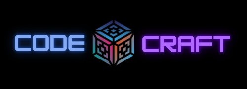

# 🚀 CODE CRAFT

> **We Believe to Develop a Better Future**

 <!-- Replace with your actual logo path -->

---

## 🌟 About Us

**Code Craft** is a student-led initiative committed to bringing **tech education to young minds** in an interactive, inspiring, and beginner-friendly way.

As part of our **Community Engagement Project**, we conduct engaging workshops on software fundamentals, HTML/CSS, and beyond – helping students gain confidence in both coding and communication!

---

## 🛠️ What We Offer

✨ **Conceptual Learning**  
- Software Introduction & Types  
- Software Development Life Cycle (SDLC)  
- Waterfall Model  

🖥 **Web Development Basics**  
- HTML Fundamentals & Tags  
- CSS Overview & Styling Types  

🎯 **Interactive Activities**  
- Creative word association tasks  
- One-on-one guidance  
- Speaking confidence rounds  
- Mini tests & personalized feedback  

🎓 **Recognition & Growth**  
- Certificate of Participation  
- Awards for top performers  
- Enrollment for upcoming programs  

---

## 👩‍💻 Meet the Team

| Name             | Role & Responsibility                                                                 |
|------------------|----------------------------------------------------------------------------------------|
| **Sneha Gond**   | *Founder, Trainee, Data Analyst* – Initiated Code Craft, leads and trains during sessions           |
| **Aryan Maurya** | *Co-Founder, Mentor & Trainee* – Co-leads and mentors sessions, helps structure plans |
| **Rohit Khetan** | *Content Creator* – Designs the syllabus and prepares informative notes                |
| **Rahul Rai**    | *Coordinator & Co-Trainer* – Manages communication, records sessions, occasionally trains |
| **Rajni Gupta**  | *Evaluation Lead* – Develops test papers, assists with assessments                     |

---

## 📸 Highlights from Our First Workshop

📍 *Rozario High School – March 2025*  
👦🏻👧🏽 Students of Classes 7th, 8th, and 9th  

🗓 **4-Day Workshop Journey**  
1. **Day 1:** Software Concepts & SDLC  
2. **Day 2:** HTML Basics + Word Association Activity  
3. **Day 3:** Tag Revision & One-to-One Mentorship  
4. **Day 4:** CSS Overview, Certificate Distribution & Confidence Rounds  

🙌 A huge shoutout to all the students who:
- Ranked in assessments  
- Earned their Certificate of Participation  
- Enrolled for our upcoming programs!  

---

## 📲 Connect With Us!

Want to join our next workshop, collaborate, or invite us to your school?  
📬 **We’d love to hear from you!**

📸 Follow us on Instagram: [@CodeCraftOfficial]([https://www.instagram.com/CodeCraftOfficial](https://www.instagram.com/_code_craft_official_?utm_source=qr&igsh=MTl0ZWxzZXRqaXlrNw==))  
📧 Contact: codecraftoffice01@gmail.com

---

**#CodeCraftWorkshop**  
**#FutureTechLeaders**  
**#CodingForAll**  
**#WeBelieveToDevelopABetterFuture**
